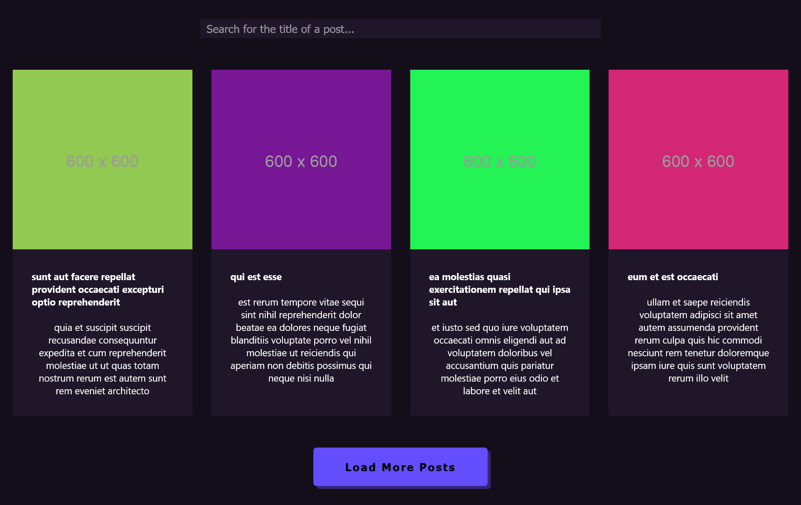

# Exibição de Posts com React 📝

## 🚀 Visão Geral

Este é um projeto React que utiliza a plataforma JsonPlaceHolder para carregar e exibir uma lista de posts. A aplicação permite aos usuários visualizarem diversos posts, além de filtrar os posts pelo nome.

## ⚙️ Funcionalidades

* **Exibição de Posts:** Carrega e exibe vários posts fornecidos pela API do JsonPlaceHolder.
* **Filtragem por Nome:** Permite filtrar os posts digitando o nome no campo de busca.
* **Layout Responsivo:** Design responsivo para ser utilizado em diferentes dispositivos.

## 🛠️ Tecnologias Utilizadas

* **React:** Desenvolvimento do frontend utilizando a biblioteca React para a criação de componentes dinâmicos.
* **JsonPlaceHolder API:** Utilização da API para obter dados e imagens dos posts.

## 📷 Capturas de Tela

## 🏃‍♂️ Como Executar o Projeto

1. **Instalação:** Clone este repositório e execute `npm install` para instalar as dependências.
2. **Inicialização:** Execute `npm start` para iniciar o servidor de desenvolvimento.
3. **Acesso:** Acesse a aplicação em seu navegador através de `http://localhost:3000`.

## 🤝 Contribuição

Contribuições são bem-vindas! Se você encontrar algum problema ou tiver sugestões para melhorias, sinta-se à vontade para abrir uma issue ou criar um pull request.
